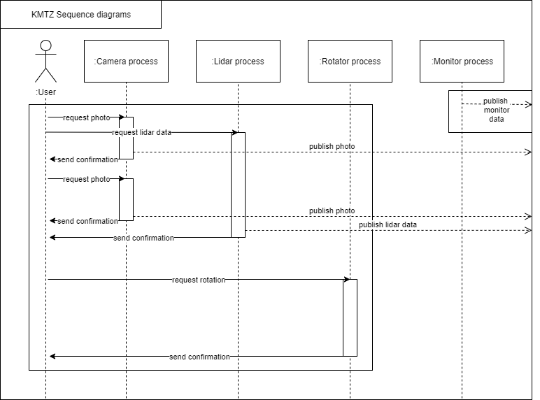

# KMTZ.GO
## Getting started developing new processes
1. Start NATS.Server (`nats-server-arm7` in RPi3 or `nats-server-v2.0.0-windows.amd64.exe` in Windows)
2. Choose appropriate example from [nats.go repository](https://github.com/nats-io/nats.go/tree/master/examples)
    > example: you should develop process that send any data after it receives request. Then, you should choose nats-rply example to use it as a wrapper for your process.
3. Compile it with:
    * `GOARM=7 GOARCH=arm GOOS=linux go build my-process.go` - for RPi3
    * `go build my-process.go` - for windows 
    
**NB!** For testing purposes choose also opposed example to create communication between your program and nats-example to ease development.

## Architecture

